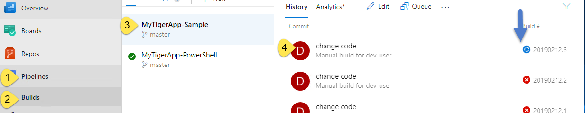

# Integrating AWS Elastic Beanstalk with Azure DevOps
# **Region must be `Sydney`**

## Introduction 
This lab demonstrates how you can integrate [AWS Elastic Beanstalk](https://aws.amazon.com/elasticbeanstalk) with [Azure DevOps](https://azure.microsoft.com/en-au/services/devops/server) to automatically deploy an ASP<span>.<span>NET core MVC application. We will edit an existing pipeline and queue a build of an existing Azure DevOps project to deploy the solution to AWS Elastic Beanstalk. 

1. Login to AWS console with the credentials provided for you.<br>
1. Navigate to EC2 section of the console, by typing EC2 in “Find Services"<br>


1. You will find three EC2 instances running in your lab environment<br>
<br>

1. | Instance Name  | Purpose |
   |:---|:---|
   | DevMachine     |This is the development machine you will login into. It has Azure DevOps express and Visual Studio code installed. You will find a project called MyTigerApp under C:\Dev\MyTigerApp
   | Build Machine  | This runs Azure DevOps build agent. If your Azure DevOps server is on-premises or in Azure, you can use Azure build agent in AWS and link your on-premises or Azure hosted Azure DevOps with AWS. You can also run this build agent in Azure or on-premises
   | MyTigerApp-Dev | An EC2 instance managed by AWS Elastic Beanstalk. Once we execute the Azure DevOps pipeline, your ASP<span>.</span>NET core MVC application will get deployed into this instance. 


1. Remote desktop into/login into **DevMachine** using following credentials.
    >Username:    **.\dev-user** <br>

    >Password:    **ILoveAWS@@##998877$$** <br>

    ||||
    |:---:|:---:|:---:|
    | 1. First  |2. Then ..  |3. Tip: Once you click connect, remember to select more choices and enter the correct username and password. Do not login as Administrator. |
   | | ||


1. Once you login to the DevMachine, open Chrome browser and navigate to Azure DevOps portal at 
   >https://dev/DefaultCollection/


1. You will find a project called MyTigerApp. Navigate to its pipelines and edit the pipeline **MyTigerApp-Sample**<br>
   |||
   |:---:|:---:|
   | First click MyTigerApp  | Then 1. navigate to Pipeline section, 2. click Builds, 3. then click  MyTigerApp-Sample and finally 4. click Edit | 
   |:|: |

1. Observe how we have constructed the pipeline. We need to change the S3 upload task to point to the correct bucket already deployed for you. Let's verify the bucket name is correct<br>
   

1. To find the correct bucket name,  go to S3 section of the AWS console. You will find a bucket starting with my-build-artifact-*some random GUID*. The GUID may be different for you. <br>
    

1. Copy the bucket name and fill the **Bucket Name** field in S3 Upload task. This will upload the zipped content of the built ASP<span>.<span>NET core website to the correct S3 bucket. <br>
  

1. You also need to change/verify the bucket name in Elastic Beanstalk deployment task.<br>

   > What we are doing in this pipeline is building an <span>ASP.NET</span> core web application, packaging it as a zip file, uploading the packaged zip file to S3 and finally telling AWS Elastic Beanstalk to take its software deployment bundle from S3

1. Make sure under **Triggers**, **Enable Continuous integration** is checked. This allows Azure DevOps to monitor any changes to git repository and execute our build pipeline automatically. If you make any modification, remember to save the pipeline. <br>


1. Click **Save & queue** and click **Save** to save any changes<br>

1. Your pipeline is now ready. Let’s now queue a new build to deploy MyTigerApp to AWS Elastic Beanstalk. Select  **Pipeline**-->**Builds**-->**MyTigerApp-Samples**-->Click **Queue**. <br>


1. Select AWSBuldPool as the build pool and master branch as the branch to build and queue a new build. This will start executing the build steps in the pipeline. <br>
 

1. Observe the execution of the pipeline. Select **Pipelines**-->**Builds**-->**MyTigerApp-Sample**-->(Select the current running build indicated with a rotating **blue icon**)<br>
<br>
You will find somehting like below <br>


1. Navigate to Elastic Beanstalk section of the AWS console. <br>
 <br>

1. You will find an application named **MyTigerApp** with an environment **MyTigerApp-Dev**. If the deployment is on-going, the environment will be greyed out.  

   |||
   |---|---|
   |1. Select the enviornment |2. Deployment status will be indicated|
   |||
   |3. Once the deployment is successful, you will see a green box |4. Once the deployment is successful, you will see a green colored icon. Select the URL and view the <span>ASP.NET<span> core web application.| 
   |||

1. You will find a simple <span>ASP.NET<span> core web application<br>


1. We now know our pipeline is working. Let’s make a modification to our website and commit it.

1. Open command line and then type<br>
   ```cmd
   cd C:\Dev\MyTigerApp
   code .
   ```
   

1. Previous step will open Visual Studio Code with MyTigerApp folder as it’s working folder. <br>


1. Navigate to the page Index.cshtml (home page) and make a modification to the page. Then save the page <kbd>Control</kbd>+<kbd>S</kbd><br>


1. 1\. Go to the repository tab, 2\. Add a comment 3\. Commit changes by clicking the √ icon and commit the changes.<br> 


1. Push the changes to Azure DevOps repository by clicking **…** button and then clicking **Push**.<br>
 

1. Since we have configured a continuous integration, this will automatically kick start a new build and deploy the application to AWS Elastic Beanstalk. <br>
 

1. Once the build is complete, check for any errors. <br>


1. Navigate to the AWS Elastic beanstalk application, and click the URL next to the environment.  Check how your new changes are reflected. <br>


1. Congratulations, you have successfully deployed an <span>ASP.NET<span> core web application to AWS Elastic Beanstalk with the help of Azure DevOps server.  
 


   
    
    


